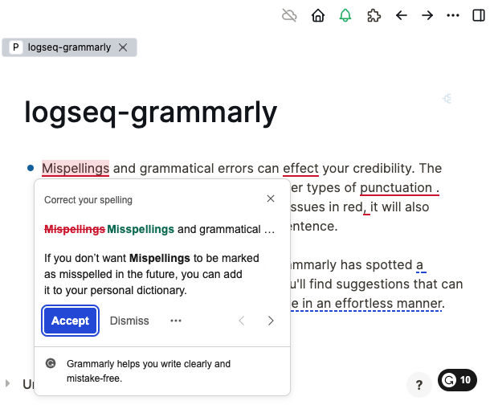
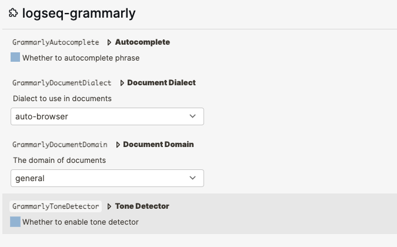

## Logseq Grammarly Plugin

A plugin to toggle Grammarly inside LogSeq.

### Demo
Enable/disable Grammarly suggestion inside LogSeq. Click the green-bell icon to toggle.

### Running the Sample

> 🏷 Minimal version of App [0.4.6](https://github.com/logseq/logseq/releases/tag/0.4.6) !

- `npm install && npm run build` in terminal to install dependencies.
- `Load unpacked plugin` in Logseq Desktop client.

### Configure
Configurable suggestions inside LogSeq.

